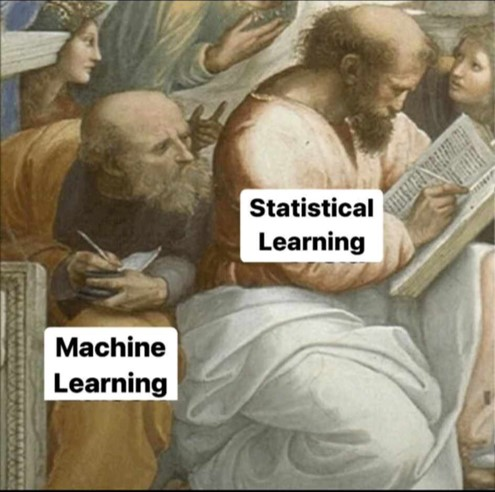

# {.scrollable background-image="Images/TemplateSL_bok.png"}
<!-- Slide – Level 1 (title only on the page) -->

Introduction

## {background-image="Images/TemplateSL_bok.png"}

<!-- Slide – level 2 (title and content -->

Purpose and Scope of Machine Learning

 <!-- content; it is recommended to place paragraphs inside 
 code blocks) -->

* What is the purpose of Machine Learning?

  * Learn patterns from data automatically
  
  * Make predictions or decisions without explicit programming
  
  * Improve performance over time as more data becomes available
  
* Key Goals

  * Prediction – Estimate future or unknown outcomes
  
  * Classification – Assign labels to data points
  
  * Clustering – Discover hidden groupings in data
  
  * Anomaly detection – Identify unusual patterns or events
  
* Scope of Applications

  * Healthcare, finance, marketing, industry, security, and more
  
  * Examples: spam filtering, disease diagnosis, fraud detection, recommendation systems
  
* Core Idea

  * "Let the data speak for itself."
  

---

## {background-image="Images/TemplateSL_bok.png"}

<!-- Slide – level 2 (title and content -->

Recent Advancements in Machine Learning

 <!-- content; it is recommended to place paragraphs inside 
 code blocks) -->

* Deep Learning Breakthroughs

  * Transformer architectures (e.g., BERT, GPT) revolutionized NLP
  
  * Diffusion models for image generation (e.g., DALL·E, Stable Diffusion)
  
  * Self-supervised learning for more efficient training
  
* Automated Machine Learning (AutoML)

  * Model selection, tuning, and deployment made easier
  
  * Tools: Google AutoML, Auto-sklearn, H2O.ai
  
* Explainable AI (XAI)

  * Methods like SHAP, LIME help interpret complex models
  
  * Greater trust and transparency in predictions
  
* Federated & Privacy-Preserving Learning

  * Learning across decentralized data sources
  
  * Preserves user privacy (e.g., in mobile devices)
  
* Real-Time & Edge ML
  * ML models running on low-power devices
  
  * Applications: smart cameras, IoT, mobile health tracking
  
* Models trained on diverse tasks and data types combining text, image, audio (e.g., CLIP, Gemini)

## {background-image="Images/TemplateSL_bok.png"}
<!-- Slide – level 2 (title and content -->

Supervised vs. Unsupervised Learning

 <!-- content; it is recommended to place paragraphs inside 
 code blocks) -->

-   Supervised learning relies on labeled data for training models, making it effective for tasks such as spam detection and medical diagnosis.

-   In contrast, unsupervised learning discovers hidden patterns in unlabeled data, commonly used in customer segmentation and anomaly detection.

# {background-image="Images/TemplateSL_bok.png"}
<!-- Slide – Level 1 (title only on the page) -->

Machine learning vs. Statistical learning

{style="display: block; margin: auto; width: 60%; height: 60%;"}

## {background-image="Images/TemplateSL_bok.png"}

<!-- Slide – level 2 (title and content -->

Machine learning vs. Statistical learning

 <!-- content; it is recommended to place paragraphs inside 
 code blocks) -->

-   Statistical learning

    -   Used to explain relationships between variables and for statistical inference
    
    -   High interpretability at the cost of limited predictive power
    
-   Machine learning

    -   Mainly used for prediction
    
    -   High predictive power at the cost of interpretability

## {background-image="Images/TemplateSL_bok.png"}

<!-- Slide – level 2 (title and content -->

Supervised vs. Unsupervised Learning

 <!-- content; it is recommended to place paragraphs inside 
 code blocks) -->

- Multiplicity of Model Hyperparameters

  - Linear Model (OLS): no parameters
  
  - K-NN: k - number of neighbours
  
  - Decision Tree: cp, minbucket, minsplit, maxdepth
  
  - Random Forest: cp, minbucket, minsplit, maxdepth, ntree, mtry
  
- Multiplicity of Algorithms

  - Decision Tree: CART, ID3, C4.5, C5.0, CHAID
  
  - Random Forest: Bagging, Random Patches, Random Subspaces, Pasting

## {background-image="Images/TemplateSL_bok.png"}

<!-- Slide – level 2 (title and content -->

Hyperparameters

 <!-- content; it is recommended to place paragraphs inside 
 code blocks) -->

- Hyperparameters in machine learning are the settings or configurations that you set before training a model — they control how the model learns from data.

- They are not learned from the data directly, but rather are set manually or through tuning.

- They significantly influence:

  - Model accuracy
  
  - Training time
  
  - Overfitting or underfitting

